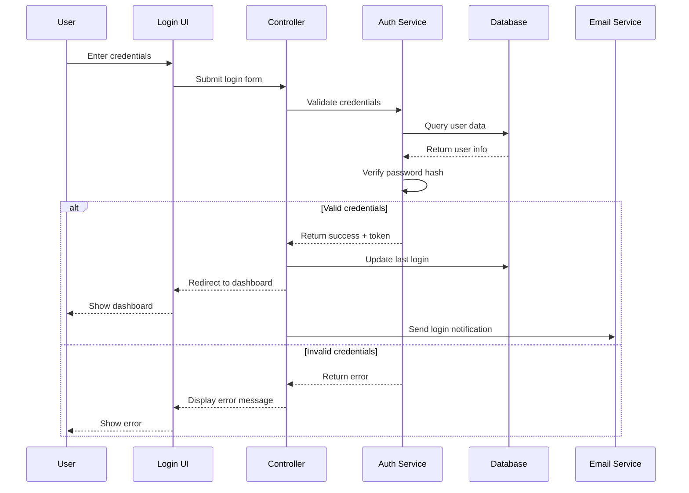
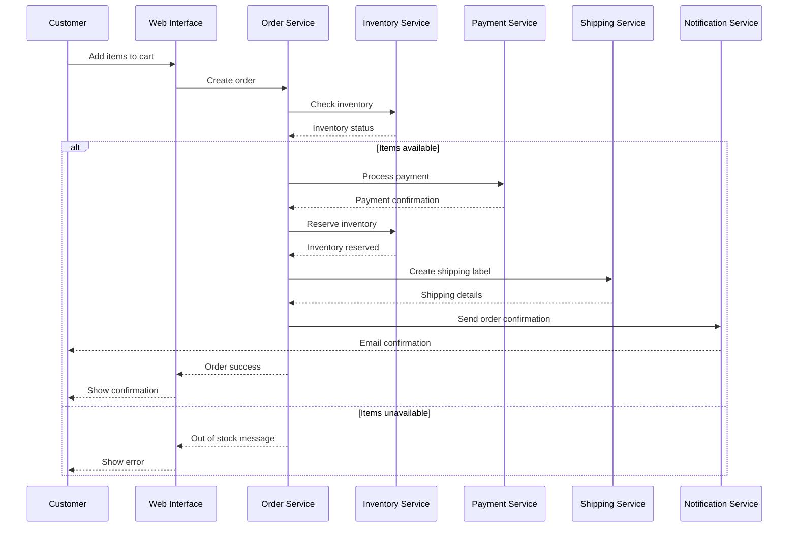
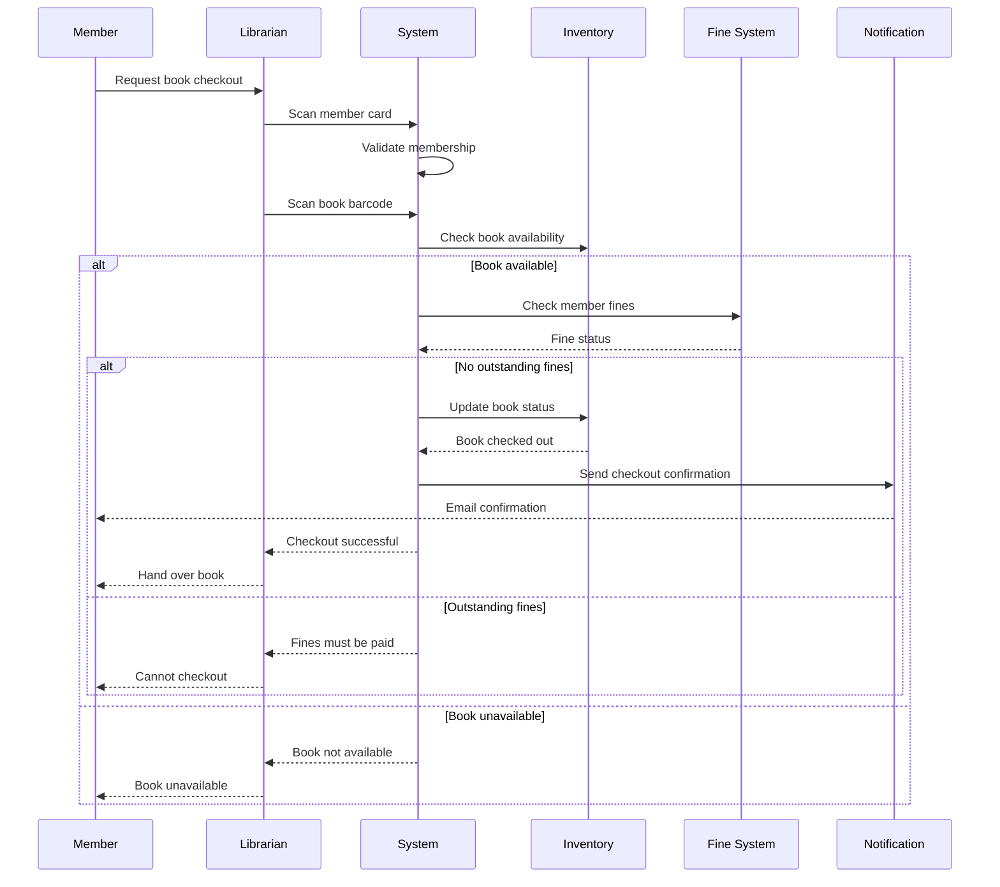
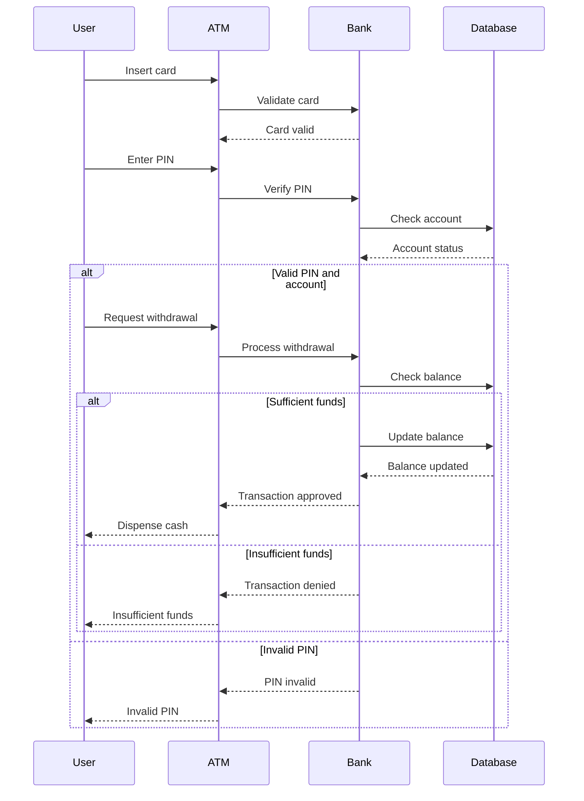
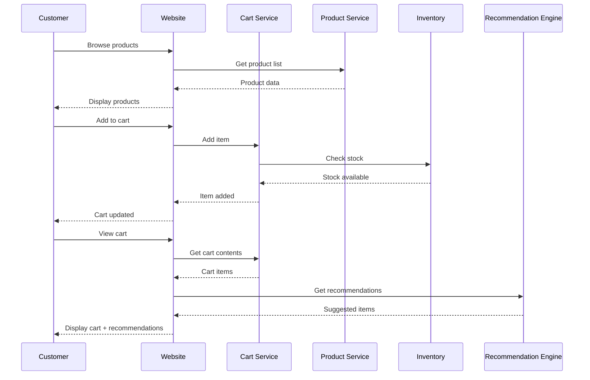

# CS-255 Sequence Diagrams

## 🎯 Purpose
Demonstrate comprehensive sequence diagram creation for system analysis and design projects, showing interactions between objects over time.

## 📝 Sequence Diagram Examples

### User Login Sequence Diagram



### E-Commerce Order Processing Sequence



### Library Book Checkout Sequence



## 🔍 Sequence Diagram Components

### 1. Lifelines
- **Represent objects or actors** in the system
- **Vertical lines** showing the object's existence over time
- **Activation boxes** show when objects are active

### 2. Messages
- **Synchronous calls**: Solid arrows with filled arrowheads
- **Asynchronous calls**: Solid arrows with open arrowheads
- **Return messages**: Dashed arrows
- **Self-calls**: Messages to the same object

### 3. Interaction Fragments
- **Alt**: Alternative paths (if-else conditions)
- **Opt**: Optional interactions
- **Loop**: Repeated interactions
- **Par**: Parallel interactions
- **Break**: Exception handling

## 📊 Advanced Sequence Diagram Examples

### ATM Transaction with Error Handling



### Online Shopping Cart Sequence



## 🛠️ Sequence Diagram Best Practices

### 1. Clarity and Readability
- **Use descriptive names** for actors and objects
- **Keep diagrams focused** on one main scenario
- **Avoid overcrowding** with too many objects
- **Use consistent notation** throughout

### 2. Message Design
- **Use action verbs** for message names
- **Include parameters** when necessary
- **Show return values** for important calls
- **Use consistent naming** conventions

### 3. Layout and Organization
- **Arrange actors** from left to right by importance
- **Group related interactions** together
- **Use activation boxes** to show object activity
- **Align messages** for better readability

### 4. Error Handling
- **Include alternative paths** for error conditions
- **Show exception handling** clearly
- **Use alt/opt fragments** for conditional logic
- **Document error scenarios** thoroughly

## 📋 Sequence Diagram Template

```markdown
# Sequence Diagram: [Scenario Name]

## Purpose
[Brief description of what the sequence diagram shows]

## Participants
- **Actor 1**: [Description]
- **Actor 2**: [Description]
- **System Component 1**: [Description]
- **System Component 2**: [Description]

## Main Flow
1. [Step 1]
2. [Step 2]
3. [Step 3]

## Alternative Flows
- **Alt 1**: [Alternative scenario]
- **Alt 2**: [Another alternative]

## Exception Flows
- **Exception 1**: [Error condition]
- **Exception 2**: [Another error]

## Notes
- [Important implementation details]
- [Performance considerations]
- [Security requirements]
```

## 🎯 CS-255 Learning Outcomes

### Technical Skills
- **Object Interaction Modeling**: Understanding how objects communicate
- **Message Sequencing**: Proper ordering of system interactions
- **Error Handling**: Modeling exception scenarios
- **System Behavior**: Capturing dynamic system behavior

### Professional Skills
- **System Documentation**: Creating clear interaction diagrams
- **Stakeholder Communication**: Visualizing complex interactions
- **Requirements Analysis**: Understanding system workflows
- **Design Validation**: Verifying system behavior

## 💡 Pro Tips

1. **Start with Happy Path**: Model the main success scenario first
2. **Add Error Handling**: Include alternative and exception paths
3. **Keep It Simple**: Don't try to show everything in one diagram
4. **Use Fragments**: Leverage alt, opt, loop, and par for clarity
5. **Focus on Interactions**: Show what happens, not how it's implemented
6. **Validate with Users**: Get feedback from actual system users
7. **Iterate and Refine**: Sequence diagrams evolve with understanding
8. **Document Assumptions**: Note any assumptions or constraints

## 🔗 Related UML Diagrams

- **Use Case Diagrams**: Show what the system does
- **Class Diagrams**: Show system structure
- **Activity Diagrams**: Show business processes
- **State Diagrams**: Show object state changes
- **Component Diagrams**: Show system architecture

---

*This sequence diagram guide provides comprehensive examples and best practices for CS-255 Systems Analysis and Design, helping students create professional-quality interaction documentation.*
