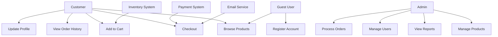
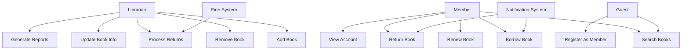

# CS-255 Use Case Diagrams

## 🎯 Purpose
Demonstrate comprehensive use case diagram creation for system analysis and design projects.

## 📝 Use Case Diagram Examples

### E-Commerce System Use Case Diagram



### Library Management System Use Case Diagram



### Student Information System Use Case Diagram

```mermaid
graph TD
    A[Student] --> B[View Grades]
    A --> C[Register for Courses]
    A --> D[View Schedule]
    A --> E[Update Profile]
    A --> F[View Transcript]
    
    G[Professor] --> H[Enter Grades]
    G --> I[View Class Roster]
    G --> J[Create Assignments]
    G --> K[View Student Info]
    
    L[Registrar] --> M[Manage Courses]
    L --> N[Process Registration]
    L --> O[Generate Reports]
    L --> P[Manage Students]
    
    Q[Academic Advisor] --> R[View Student Progress]
    Q --> S[Approve Course Selection]
    Q --> T[Generate Academic Plan]
```



## 🔍 Use Case Specifications

### Example 1: User Registration Use Case

**Use Case Name**: Register New User  
**Actor**: Guest User  
**Preconditions**: User is not logged in  
**Postconditions**: User account is created and user is logged in  

**Main Flow**:
1. User clicks "Register" button
2. System displays registration form
3. User enters required information (name, email, password)
4. User submits form
5. System validates information
6. System creates new user account
7. System sends confirmation email
8. System displays success message
9. User is automatically logged in

**Alternative Flows**:
- 3a. User enters invalid email format
  - 3a1. System displays error message
  - 3a2. Return to step 3
- 5a. Email already exists
  - 5a1. System displays error message
  - 5a2. Return to step 3

**Exception Flows**:
- 6a. Database connection fails
  - 6a1. System displays error message
  - 6a2. Use case terminates

### Example 2: Process Order Use Case

**Use Case Name**: Process Customer Order  
**Actor**: Customer  
**Preconditions**: Customer is logged in and has items in cart  
**Postconditions**: Order is created and payment is processed  

**Main Flow**:
1. Customer clicks "Checkout"
2. System displays order summary
3. Customer enters shipping information
4. Customer selects payment method
5. Customer enters payment details
6. System validates payment information
7. System processes payment
8. System creates order
9. System sends confirmation email
10. System displays order confirmation

**Alternative Flows**:
- 6a. Payment validation fails
  - 6a1. System displays error message
  - 6a2. Return to step 5
- 7a. Payment processing fails
  - 7a1. System displays error message
  - 7a2. Return to step 5

## 📊 Use Case Diagram Best Practices

### 1. Actor Identification
- **Primary Actors**: Users who directly interact with the system
- **Secondary Actors**: External systems or services
- **System Actors**: Automated processes or timers

### 2. Use Case Naming
- Use action verbs (Register, Login, Process, Generate)
- Be specific and descriptive
- Use consistent naming conventions
- Avoid technical jargon

### 3. Relationship Types
- **Association**: Direct interaction between actor and use case
- **Include**: Mandatory relationship (use case A must include use case B)
- **Extend**: Optional relationship (use case A may extend use case B)
- **Generalization**: Inheritance relationship

### 4. System Boundaries
- Clearly define what's inside vs. outside the system
- Include only use cases that the system handles
- External systems should be shown as actors

## 🛠️ Tools for Creating Use Case Diagrams

### Software Tools
- **Lucidchart**: Web-based diagramming tool
- **Draw.io**: Free online diagramming
- **Visio**: Microsoft's diagramming software
- **Enterprise Architect**: Professional UML tool
- **PlantUML**: Text-based diagram generation

### Online Tools
- **Mermaid**: Markdown-based diagramming
- **Creately**: Collaborative diagramming
- **Gliffy**: Simple diagramming tool
- **Cacoo**: Real-time collaboration

## 📋 Use Case Template

```markdown
# Use Case: [Use Case Name]

## Basic Information
- **Actor**: [Primary Actor]
- **Goal**: [What the actor wants to achieve]
- **Scope**: [System boundary]
- **Level**: [Summary/User Goal/Subfunction]

## Preconditions
- [Condition 1]
- [Condition 2]

## Postconditions
- [Result 1]
- [Result 2]

## Main Success Scenario
1. [Step 1]
2. [Step 2]
3. [Step 3]

## Extensions
- [Alternative path 1]
- [Alternative path 2]

## Exceptions
- [Exception 1]
- [Exception 2]

## Special Requirements
- [Performance requirement]
- [Security requirement]
- [Usability requirement]
```

## 🎯 CS-255 Learning Outcomes

### Technical Skills
- **Use Case Modeling**: Creating comprehensive use case diagrams
- **Actor Identification**: Recognizing all system stakeholders
- **Relationship Modeling**: Understanding include, extend, and generalization
- **System Boundary Definition**: Clearly defining system scope

### Professional Skills
- **Stakeholder Communication**: Presenting system requirements visually
- **Requirements Analysis**: Breaking down complex systems into use cases
- **Documentation**: Creating detailed use case specifications
- **System Design**: Understanding user interactions and workflows

## 💡 Pro Tips

1. **Start Simple**: Begin with high-level use cases, then add detail
2. **User-Centric**: Focus on what users want to accomplish
3. **Be Specific**: Avoid vague or overly general use cases
4. **Review Regularly**: Use cases should evolve with requirements
5. **Stakeholder Input**: Get feedback from actual users
6. **Consistent Style**: Use the same level of detail throughout
7. **Test Scenarios**: Each use case should be testable
8. **Traceability**: Link use cases to requirements and test cases

---

*This use case diagram guide provides comprehensive examples and best practices for CS-255 Systems Analysis and Design, helping students create professional-quality system documentation.*
