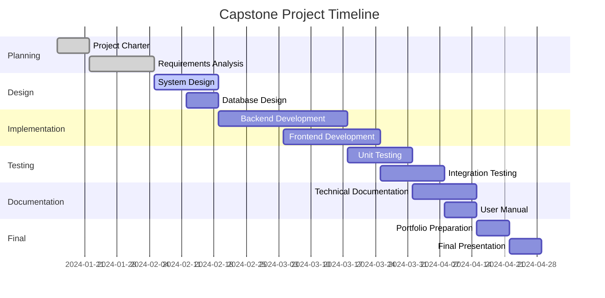

# CS-499 Capstone Project Planning

## 🎯 Purpose
Demonstrate comprehensive project planning, timeline management, and milestone tracking for capstone projects.

## 📝 Project Planning Examples

### Project Charter Template
```markdown
# Capstone Project Charter

## Project Information
- **Project Title**: [Your Project Name]
- **Student Name**: [Your Name]
- **Course**: CS-499 Capstone
- **Term**: [Term/Year]
- **Instructor**: [Instructor Name]

## Project Overview
### Problem Statement
[Describe the problem your project solves]

### Project Goals
- Primary Goal: [Main objective]
- Secondary Goals: [Additional objectives]

### Success Criteria
- [ ] Functional requirements met
- [ ] Technical requirements satisfied
- [ ] Documentation complete
- [ ] Presentation delivered

## Scope
### In Scope
- [List what's included in the project]

### Out of Scope
- [List what's explicitly excluded]

## Timeline
| Milestone | Due Date | Deliverables |
|-----------|----------|--------------|
| Project Proposal | Week 2 | Project charter, initial research |
| Requirements Analysis | Week 4 | Requirements document, use cases |
| Design Phase | Week 6 | System design, architecture diagrams |
| Implementation | Week 10 | Core functionality, testing |
| Testing & Debugging | Week 12 | Test results, bug fixes |
| Documentation | Week 14 | User manual, technical docs |
| Final Presentation | Week 16 | Demo, presentation, portfolio |

## Resources Required
- Development Environment: [List tools/software]
- Hardware: [List any special hardware needs]
- External APIs/Services: [List third-party services]
- Learning Resources: [Books, tutorials, documentation]

## Risk Assessment
| Risk | Probability | Impact | Mitigation Strategy |
|------|-------------|--------|-------------------|
| Technical complexity | Medium | High | Early prototyping, research |
| Time constraints | High | High | Detailed scheduling, buffer time |
| Scope creep | Medium | Medium | Clear scope definition |
| Technology learning curve | High | Medium | Early learning, tutorials |
```

### Gantt Chart Example


### Weekly Progress Tracking
```markdown
# Week [X] Progress Report

## Completed This Week
- [ ] Task 1: [Description]
- [ ] Task 2: [Description]
- [ ] Task 3: [Description]

## In Progress
- [ ] Current Task: [Description]
  - Progress: [X]% complete
  - Blockers: [List any issues]

## Next Week's Goals
- [ ] Goal 1: [Description]
- [ ] Goal 2: [Description]
- [ ] Goal 3: [Description]

## Challenges & Solutions
### Challenge: [Description]
**Solution**: [How you addressed it]

### Challenge: [Description]
**Solution**: [How you addressed it]

## Time Tracking
- Total hours this week: [X]
- Hours on development: [X]
- Hours on research: [X]
- Hours on documentation: [X]

## Screenshots/Demos
[Include screenshots or demo links]

## Code Commits
[Link to GitHub commits or describe code changes]
```

### Risk Management Plan
```markdown
# Risk Management Plan

## Risk Categories

### Technical Risks
| Risk | Impact | Probability | Mitigation |
|------|--------|-------------|------------|
| Technology learning curve | High | High | Start learning early, use tutorials |
| Integration challenges | Medium | Medium | Prototype early, test frequently |
| Performance issues | Medium | Low | Load testing, optimization |

### Schedule Risks
| Risk | Impact | Probability | Mitigation |
|------|--------|-------------|------------|
| Scope creep | High | Medium | Clear requirements, change control |
| Underestimated complexity | High | Medium | Buffer time, early prototyping |
| External dependencies | Medium | Low | Backup plans, alternatives |

### Resource Risks
| Risk | Impact | Probability | Mitigation |
|------|--------|-------------|------------|
| Hardware limitations | Medium | Low | Cloud alternatives, optimization |
| Software licensing | Low | Low | Open source alternatives |
| Internet connectivity | Low | Low | Offline development options |

## Contingency Plans
- **Plan A**: [Primary approach]
- **Plan B**: [Alternative approach if Plan A fails]
- **Plan C**: [Fallback approach if Plan B fails]
```

## 🔍 Project Management Best Practices

### Time Management
- **Pomodoro Technique**: 25-minute focused work sessions
- **Time Blocking**: Dedicate specific time slots for different tasks
- **Buffer Time**: Add 20% extra time to estimates
- **Regular Reviews**: Weekly progress assessments

### Communication
- **Weekly Updates**: Regular progress reports to instructor
- **Documentation**: Keep detailed logs of decisions and changes
- **Version Control**: Use Git for code and documentation
- **Backup Strategy**: Multiple backup locations

## 💡 Learning Points
- Detailed planning prevents scope creep and missed deadlines
- Regular progress tracking helps identify issues early
- Risk management prepares you for potential problems
- Clear documentation supports successful project completion
- Time management skills are crucial for capstone success
