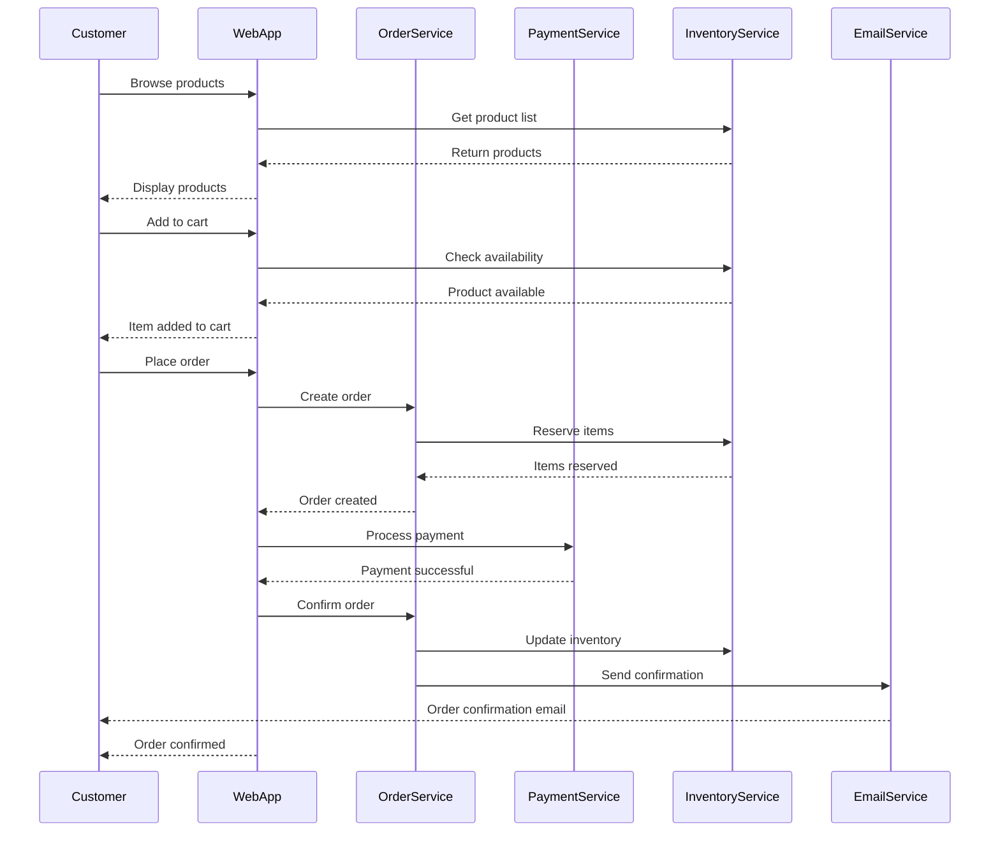
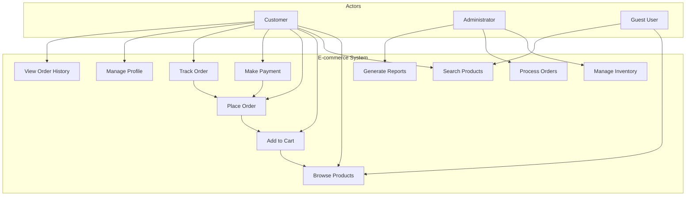
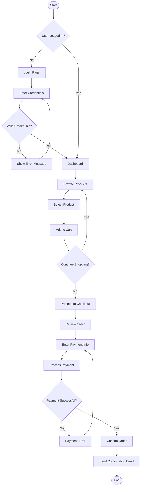
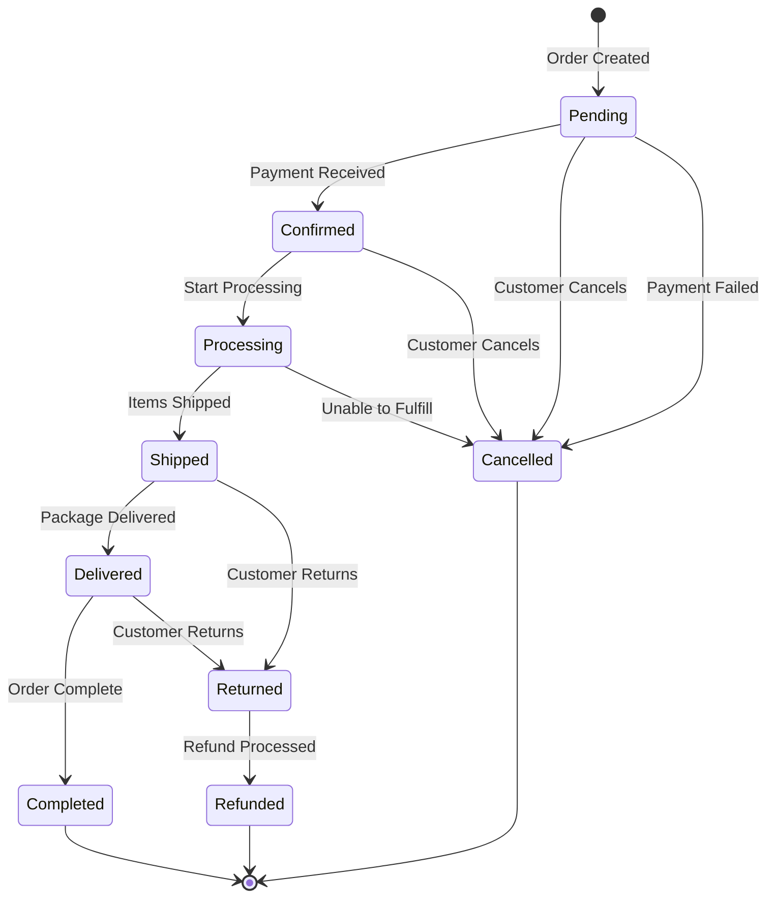
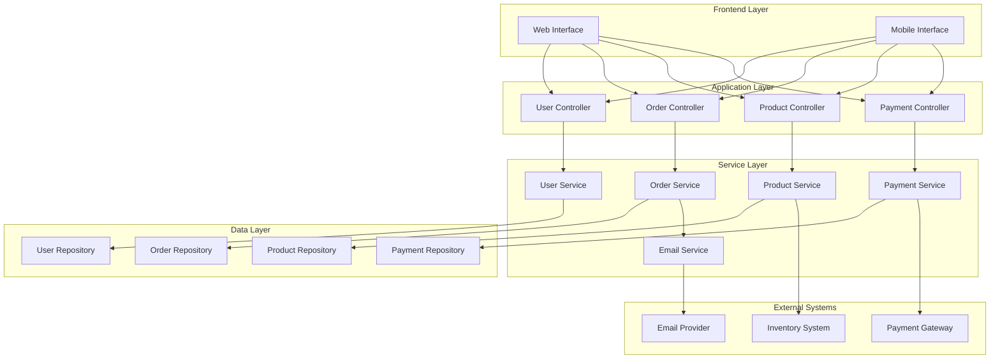

# IT-315 UML Diagrams and OOAD

## 🎯 Purpose
Demonstrate UML diagram creation and object-oriented analysis and design principles.

## 📝 UML Diagram Examples

### Class Diagram
```mermaid
classDiagram
    class User {
        -String userId
        -String username
        -String email
        -String password
        -Date createdAt
        +User(String username, String email)
        +login(String password) boolean
        +logout() void
        +updateProfile(String email) void
        +changePassword(String oldPass, String newPass) boolean
    }
    
    class Order {
        -String orderId
        -Date orderDate
        -OrderStatus status
        -double totalAmount
        -User customer
        -List~OrderItem~ items
        +Order(User customer)
        +addItem(Product product, int quantity) void
        +removeItem(String productId) void
        +calculateTotal() double
        +updateStatus(OrderStatus status) void
    }
    
    class Product {
        -String productId
        -String name
        -String description
        -double price
        -int stockQuantity
        -Category category
        +Product(String name, double price)
        +updatePrice(double newPrice) void
        +updateStock(int quantity) void
        +isAvailable() boolean
    }
    
    class OrderItem {
        -String itemId
        -Product product
        -int quantity
        -double unitPrice
        +OrderItem(Product product, int quantity)
        +calculateSubtotal() double
        +updateQuantity(int newQuantity) void
    }
    
    class Category {
        -String categoryId
        -String name
        -String description
        -List~Product~ products
        +Category(String name)
        +addProduct(Product product) void
        +removeProduct(String productId) void
    }
    
    class Payment {
        -String paymentId
        -PaymentMethod method
        -double amount
        -PaymentStatus status
        -Date paymentDate
        +Payment(PaymentMethod method, double amount)
        +processPayment() boolean
        +refund() boolean
    }
    
    User ||--o{ Order : places
    Order ||--o{ OrderItem : contains
    OrderItem }o--|| Product : references
    Product }o--|| Category : belongs to
    Order ||--|| Payment : has
```

### Sequence Diagram


### Use Case Diagram


### Activity Diagram


### State Diagram


### Component Diagram


## 🔍 OOAD Principles

### SOLID Principles
1. **Single Responsibility**: Each class has one reason to change
2. **Open/Closed**: Open for extension, closed for modification
3. **Liskov Substitution**: Derived classes must be substitutable for base classes
4. **Interface Segregation**: Clients shouldn't depend on unused interfaces
5. **Dependency Inversion**: Depend on abstractions, not concretions

### Design Patterns
- **Factory Pattern**: Create objects without specifying exact classes
- **Observer Pattern**: Define one-to-many dependency between objects
- **Strategy Pattern**: Define family of algorithms and make them interchangeable
- **Singleton Pattern**: Ensure class has only one instance

## 💡 Learning Points
- UML diagrams provide visual representation of system design
- Class diagrams show static structure and relationships
- Sequence diagrams illustrate dynamic interactions
- Use case diagrams capture functional requirements
- Activity diagrams model business processes
- State diagrams show object lifecycle
- Component diagrams show system architecture
